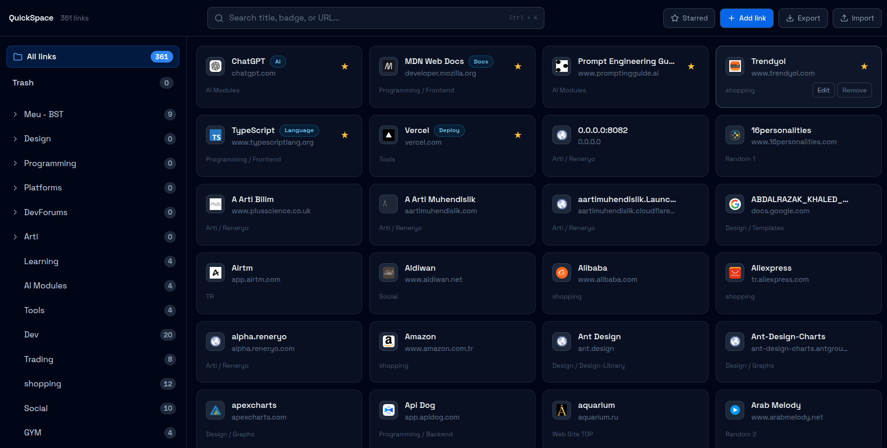

# QuickSpace

QuickSpace is a local-first bookmark launcher for organizing links into folders, editing entries quickly, and launching sites from a clean Chrome-style sidebar.

## Screenshot

## Features

- Folder-based sidebar with nested folders
- Fast search across title, URL, badge, and description
- Favorites filtering for quick access
- Inline edit actions for folders and links
- Link badges and favicon icons for easier scanning
- JSON export and import for transferring data between devices
- Local storage persistence with automatic save

## Tech Stack

- React 19
- TypeScript
- Vite
- Tailwind CSS

## Scripts

- `npm run dev` - start the development server
- `npm run build` - type-check and build for production
- `npm run lint` - run ESLint
- `npm run preview` - preview the production build locally

## Data Storage

QuickSpace stores your folders and links in browser local storage. If you want to move your data to another laptop or browser, use the built-in JSON export and import buttons.

## Development

1. Install dependencies with `npm install`.
2. Start the app with `npm run dev`.
3. Open the local URL shown in the terminal.

